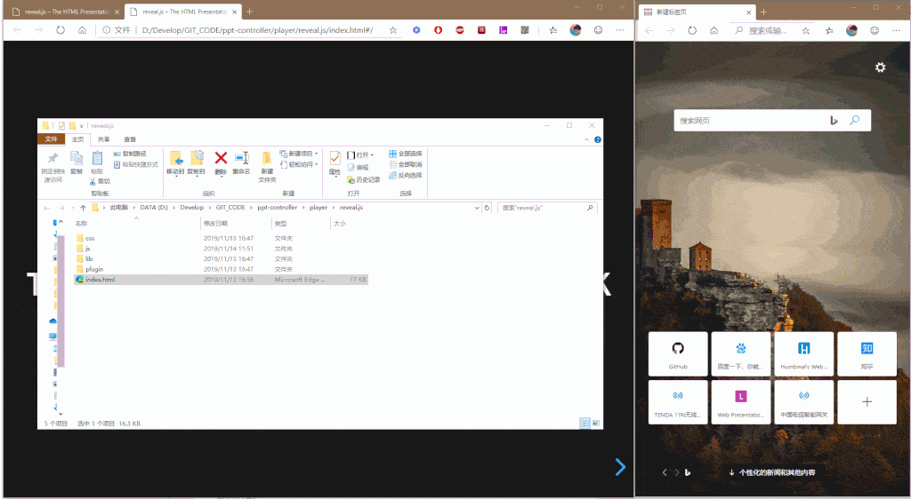

Web Based PPT Controller

## 主要功能
通过一台设备控制另外一台设备的PPT播放。

控制设备可以是：电脑浏览器、手机浏览器、手机APP(待开发)

播放设备可以是：网页PPT(如 impress.js、reveal.js)、电脑PPT(如Office、WPS等, 当前未实现)

## 主要设计

ppt控制分为控制端和被控制端，以及衔接他们的服务端。

被控制端称为播放器，播放器的实现有impress.js、reveal.js和Office这两种，他们启动时随机生成一个ID，注册到服务器，并将ID告知用户。

控制端称为控制器，控制器是一个静态页面，打开时提供输入框，输入播放器端生成的ID，然后发送ID并注册到服务器。

控制器连接时可以判断对应ID的播放器是否在线，提高使用可靠性。

控制器控制时发送自己的ID以及控制指令，服务端即可根据ID进行控制指令的分发，发送到对应的播放器，播放器只担当接受指令并控制PPT播放的功能。


## 目录结构
```
docs 一些开发文档记录
server 服务端代码，包括控制器前端代码: server/static/index.html
player 各种播放器实现
  --impress.js 经典HTML ppt impress.js 的播放控制例子
  --reveal.js 超流行的reveal.js基于markdown的PPT 的播放器控制例子
  --native-player-controller 实现微软Office、WPS等本地PPT程序的控制，实现逻辑不同，通过网页无法实现控制Office，需要编写客户端程序
```

## 开发计划

- [x]  控制器服务端及Web开发,手机，电脑浏览网页均可
- [x]  播放器，控制基于浏览器的PPT播放
- [ ]  播放器，控制Office-PowerPoint、WPS等的native控制器
- [ ]  安卓、IOS等native控制器应用开发

## 使用流程

1. 本地服务器部署

启动server
```
cd server
npm install
node app.js
```

浏览器访问控制器
```
http://localhost:3000
```

开发player的一种实现
```
例如 reveal.js
reveal.js的示例中修改了  index.html 增加了 js/controller.js 的引用
js/controller.js 是实现控制的全部逻辑，文件第一行配置了服务器地址
直接用浏览器打开 index.html 即可控制
```

## 使用截图



## 快速使用

当前提供了已经部署的服务端地址，可以打开播放器修改`js/controller.js`中的服务器地址，完成快速测试使用，不保证服务长期可用，建议自己搭建服务器。

服务器地址 `ws://humbinal.com:3000`

